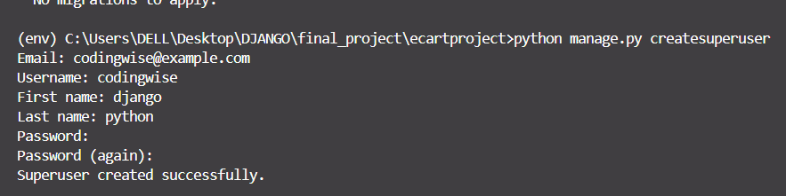
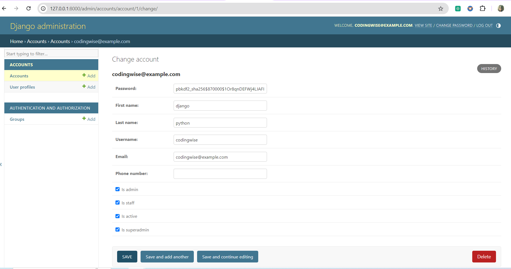

1. Create folder "Final_Project"
2. Create virtual enviroment :

```bash
\final_project> python -m venv env
```
3. Activate Virtual Enviroment
```bash
cd Scripts
activate
```
4. Go back to final_project
```bash
cd..
cd..
```
5. Install django in project
```bash
pip install django
```
6. create a Application -> "ecartproject"
```bash
django-admin startproject ecartproject
cd ecartproject
```
7. Under ecartproject >> Account application
```bash
python manage.py startapp accounts
```

8.   Go to ecartproject/settings.py ->> Add application name

```bash
INSTALLED_APPS = [
    "accounts",
    "django.contrib.admin",
    "django.contrib.auth",
    "django.contrib.contenttypes",
    "django.contrib.sessions",
    "django.contrib.messages",
    "django.contrib.staticfiles",
]

```
9. Go to accounts/models.py
    We Created 3 class
    i) class MyAccountManager () -> To create user and superuser
    ii) class Account() -> To take all properties of Auth user
    iii) class UserProfile() -> Account is line as one to one relationship

10. Go to ecartproject/settings.py : Add below line in code----------> Most importatnt line

Note : After adding this line provide GIT Message
```bash
AUTH_USER_MODEL = 'account.Account'
```
Meaning : Under accounts package -> inside Account class -> It will take the auth user  models previllages
```python 
WSGI_APPLICATION = "ecartproject.wsgi.application"

AUTH_USER_MODEL = 'account.Account'

# Database
# https://docs.djangoproject.com/en/5.1/ref/settings/#databases

DATABASES = {
    "default": {
        "ENGINE": "django.db.backends.sqlite3",
        "NAME": BASE_DIR / "db.sqlite3",
    }
}

```

11. Go to account/admin.py : To register the application add below line
```python
from .models import UserProfile,Account

# Register your models here.
admin.site.register(UserProfile)
admin.site.register(Account)
```
12. Got terminal :
```bash
python manage.py makemigrations
python mange.py migrate

```
13. To upload Image like Userprofile image django required Pillow libary
To install Pillow Labary
```bash
pip install Pillow
```

14. Create Superuser
```bash
python manage.py createsuperuser
```


password : coding123

15. Runserver
```bash
python manage.py runserver
```
16. Check on browser "Account" application and "Userprofile" is display
